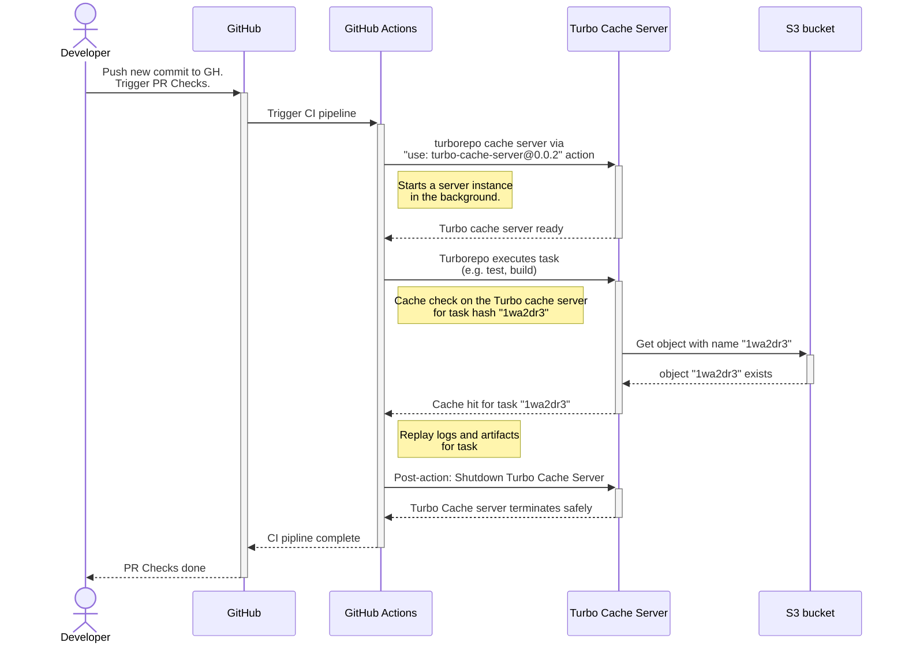
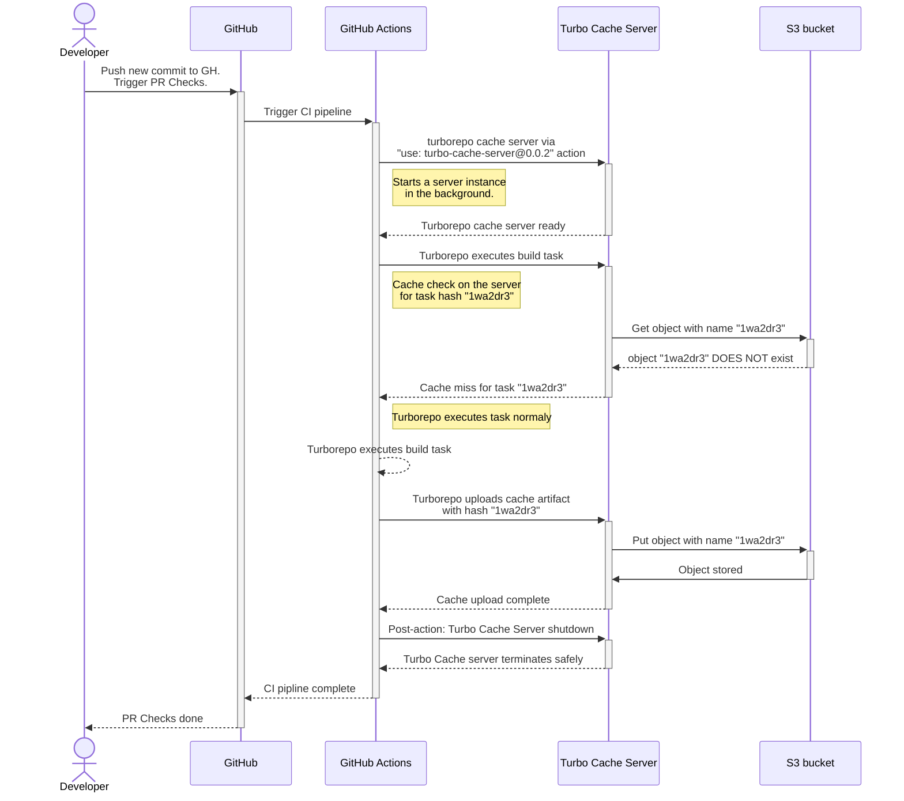

<p align="center"><br></p>
<h2 align="center">Turbo Cache Server</h2>
<p align="center">
  <a href="https://turbo.build/repo">Turborepo</a> remote cache server, <a href="https://turbo.build/repo/docs/core-concepts/remote-caching#self-hosting">API-compliant</a> as a GitHub Action or Docker with S3-compatible storage support.
</p>

### How can I use this in my monorepo?

Make sure that you have an S3-compatible storage available. We currently tested
with:

- [Amazon S3](https://aws.amazon.com/s3/)
- [Cloudflare R2](https://www.cloudflare.com/en-gb/developer-platform/r2/)
- [Minio Object Storage](https://min.io/)

You can use the Turbo Cache Server as a **GitHub Action**. Here is how:

1.  In your workflow files, add the following global environment variables:

    ```yml
    env:
      TURBO_API: "http://127.0.0.1:8585"
      TURBO_TEAM: "NAME_OF_YOUR_REPO_HERE"
      # The value of TURBO_TOKEN will be checked by the cache server
      TURBO_TOKEN: "secret-turbo-token"
    ```

1.  In the same workflow file, after checking out your code,
    start the Turbo Cache Server in the background:

    ````yml
        - name: Checkout repository
          uses: actions/checkout@v4

        - name: Turborepo Cache Server
          # ALWAYS use a pinned version of the action
          # As we don't ship the latest versions of the binary on the main branch
          # PLEASE see the latest versions here:
          # https://github.com/brunojppb/turbo-cache-server/releases
          uses: brunojppb/turbo-cache-server@2.0.2
          env:
            PORT: "8585"
            S3_BUCKET_NAME: your-bucket-name-here
            # Region defaults to "eu-central-1"
            S3_REGION: "eu-central-1"
            # Optional: If you need to provide specific auth keys, separate from default AWS credentials
            S3_ACCESS_KEY: ${{ secrets.S3_ACCESS_KEY }}
            S3_SECRET_KEY: ${{ secrets.S3_SECRET_KEY }}
            # Optional: If not using AWS, provide endpoint like `https://minio` for your instance.
            S3_ENDPOINT: ${{ secrets.S3_ENDPOINT }}
            # Optional: If your S3-compatible store does not support requests
            # like https://bucket.hostname.domain/. Setting `S3_USE_PATH_STYLE`
            # to true configures the S3 client to make requests like
            # https://hostname.domain/bucket instead.
            # Defaults to "false"
            S3_USE_PATH_STYLE: false
            # Optional: Enable server-side encryption for stored artifacts.
            # Valid values: AES256, aws:kms, aws:kms:dsse, aws:fsx
            S3_SERVER_SIDE_ENCRYPTION: "AES256"
            # Max payload size for each cache object sent by Turborepo
            # Defaults to 100 MB
            # Requests larger than that, will get "HTTP 413: Entity Too Large" errors
            MAX_PAYLOAD_SIZE_IN_MB: "100"

        # Now you can run your turborepo tasks and rely on the cache server
        # available in the background to provide previously built artifacts (cache hits)
        # and let Turborepo upload new artifacts when there is a cache miss.
        - name: Run tasks
          run: turbo run test build typecheck
        ```
    ````

And that is all you need to use our remote cache server for Turborepo. As a
reference, take a look at
[this example workflow file](https://github.com/brunojppb/turbo-decay/blob/main/.github/workflows/ci.yml)
for inspiration.

> [!NOTE]
> These environment variables are required by Turborepo so it can call
> the Turbo Cache Server with the right HTTP body, headers and query strings.
> These environment variables are necessary so the Turborepo binary can identify
> the Remote Cache feature is enabled and can use them across all steps. You can
> [read more about this here](https://turbo.build/repo/docs/ci#setup) on the
> Turborepo official docs.

## Gitlab support

For folks using Gitlab or any other CI environment that supports Docker,
you can run the Turbo Cache Server as a docker container:

```shell
docker run \
  -e S3_ACCESS_KEY=KEY \
  -e S3_SECRET_KEY=SECRET \
  -e S3_BUCKET_NAME=my_cache_bucket \
  -e S3_ENDPOINT=https://s3_endpoint_here \
  -e S3_REGION=eu \
  -e S3_SERVER_SIDE_ENCRYPTION=AES256 \
  -e TURBO_TOKEN=secret-turbo-token \
  -p "8000:8000" \
  ghcr.io/brunojppb/turbo-cache-server
```

## Deploying to Kubernetes

Turbo Cache Server is a cloud-native, stateless application that runs seamlessly in Kubernetes environments. This makes it ideal for horizontally scaled deployments across multiple pods.

### Prerequisites

- A Kubernetes cluster (v1.20 or higher recommended)
- `kubectl` configured to access your cluster
- An S3-compatible storage bucket configured
- S3 credentials stored as Kubernetes secrets

### Minimal Deployment Configuration

Below is a minimal setup to deploy Turbo Cache Server to your Kubernetes cluster:

#### 1. Create a Secret for S3 Credentials

```yaml
apiVersion: v1
kind: Secret
metadata:
  name: turbo-cache-s3-credentials
  namespace: default
type: Opaque
stringData:
  S3_ACCESS_KEY: "your-access-key-here"
  S3_SECRET_KEY: "your-secret-key-here"
  TURBO_TOKEN: "secret-turbo-token"
```

Apply the secret:

```shell
kubectl apply -f turbo-cache-secret.yaml
```

#### 2. Create a Deployment

```yaml
apiVersion: apps/v1
kind: Deployment
metadata:
  name: turbo-cache-server
  namespace: default
spec:
  replicas: 2 # Scale horizontally as needed
  selector:
    matchLabels:
      app: turbo-cache-server
  template:
    metadata:
      labels:
        app: turbo-cache-server
    spec:
      containers:
        - name: turbo-cache-server
          image: ghcr.io/brunojppb/turbo-cache-server:latest
          ports:
            - containerPort: 8000
              name: http
          env:
            - name: PORT
              value: "8000"
            - name: S3_BUCKET_NAME
              value: "your-bucket-name-here"
            - name: S3_REGION
              value: "eu-central-1"
            - name: S3_ACCESS_KEY
              valueFrom:
                secretKeyRef:
                  name: turbo-cache-s3-credentials
                  key: S3_ACCESS_KEY
            - name: S3_SECRET_KEY
              valueFrom:
                secretKeyRef:
                  name: turbo-cache-s3-credentials
                  key: S3_SECRET_KEY
            - name: TURBO_TOKEN
              valueFrom:
                secretKeyRef:
                  name: turbo-cache-s3-credentials
                  key: TURBO_TOKEN
            - name: S3_ENDPOINT
              value: "https://your-s3-endpoint.com"
            - name: S3_SERVER_SIDE_ENCRYPTION
              value: "AES256"
            - name: MAX_PAYLOAD_SIZE_IN_MB
              value: "100"
          resources:
            requests:
              memory: "128Mi"
              cpu: "100m"
            limits:
              memory: "256Mi"
              cpu: "500m"
          livenessProbe:
            httpGet:
              path: /management/health
              port: 8000
            initialDelaySeconds: 10
            periodSeconds: 10
          readinessProbe:
            httpGet:
              path: /management/health
              port: 8000
            initialDelaySeconds: 5
            periodSeconds: 5
```

Apply the deployment:

```shell
kubectl apply -f turbo-cache-deployment.yaml
```

#### 3. Create a Service

```yaml
apiVersion: v1
kind: Service
metadata:
  name: turbo-cache-server
  namespace: default
spec:
  selector:
    app: turbo-cache-server
  ports:
    - protocol: TCP
      port: 8000
      targetPort: 8000
  type: ClusterIP
```

Apply the service:

```shell
kubectl apply -f turbo-cache-service.yaml
```

#### 4. (Optional) Create an Ingress

If you need to expose the service externally:

```yaml
apiVersion: networking.k8s.io/v1
kind: Ingress
metadata:
  name: turbo-cache-ingress
  namespace: default
  annotations:
    # Configure based on your ingress controller
    # nginx.ingress.kubernetes.io/rewrite-target: /
spec:
  rules:
    - host: turbo.yourdomain.com
      http:
        paths:
          - path: /
            pathType: Prefix
            backend:
              service:
                name: turbo-cache-server
                port:
                  number: 8000
```

Apply the ingress:

```shell
kubectl apply -f turbo-cache-ingress.yaml
```

### Configuring Turborepo

Once deployed, configure your Turborepo clients to use the Kubernetes service:

```shell
export TURBO_API="http://turbo-cache-server.default.svc.cluster.local:8000"
export TURBO_TEAM="your-team-name"
export TURBO_TOKEN="secret-turbo-token"
```

For external access through ingress:

```shell
export TURBO_API="https://turbo.yourdomain.com"
export TURBO_TEAM="your-team-name"
export TURBO_TOKEN="secret-turbo-token"
```

## Managing Cache Storage with Lifecycle Rules

As your cache grows over time, you may want to automatically expire old cache entries to control storage usage and costs. Since Turbo Cache Server uses S3-compatible storage, you can configure bucket lifecycle rules to automatically delete objects after a specified period.

> [!NOTE]
> Lifecycle rules are configured at the S3 bucket level, not within the Turbo Cache Server itself. This allows you to manage storage independently of the cache server configuration.

### Setting up Object Expiration

Object expiration is based on the last modified time of objects in your bucket. You can configure expiration in two ways:

- **Days**: Objects will be deleted after a specified number of days (most common for a long running cache-server)
- **Date**: Objects will be deleted on a specific date

### AWS S3 and S3-Compatible Providers

For AWS S3, Cloudflare R2, Minio, and other S3-compatible providers, you can use the AWS CLI to configure lifecycle rules.

#### Expire objects after 30 days

Create a JSON file named `lifecycle.json` with the following content:

```json
{
  "Rules": [
    {
      "Status": "Enabled",
      "Expiration": {
        "Days": 30
      }
    }
  ]
}
```

Then apply the lifecycle configuration to your bucket:

```shell
aws s3api put-bucket-lifecycle-configuration \
  --bucket your-bucket-name \
  --lifecycle-configuration file://lifecycle.json
```

#### Expire objects on a specific date

You can also set a specific expiration date:

```json
{
  "Rules": [
    {
      "Status": "Enabled",
      "Expiration": {
        "Date": "2025-12-31T00:00:00Z"
      }
    }
  ]
}
```

### Provider-Specific Notes

- **AWS S3**: Full lifecycle management support. See the [AWS S3 Lifecycle documentation](https://docs.aws.amazon.com/AmazonS3/latest/userguide/lifecycle-expire-general-considerations.html) for advanced options like transitioning to different storage classes.
- **Cloudflare R2**: Supports S3-compatible lifecycle API. Use the same AWS CLI commands with your R2 endpoint.
- **Tigris**: Supports object expiration via lifecycle rules. See the [Tigris object expiration documentation](https://www.tigrisdata.com/docs/buckets/objects-expiration/) for details.
- **Minio**: Supports S3-compatible lifecycle configuration. Use the AWS CLI with your Minio endpoint.

### Important Considerations

- **Lifecycle rules apply to all objects** in the bucket. If you're using the bucket for other purposes, consider using a dedicated bucket for cache storage or add filters to your lifecycle rules.
- **Expiration is asynchronous**: There may be a delay between the expiration date and when objects are actually removed.
- **Versioning**: If your bucket has versioning enabled, expiration rules apply only to current object versions. You may need separate rules for noncurrent versions.

## How does that work?

Turbo Cache Server is a tiny web server written in
[Rust](https://www.rust-lang.org/) that uses any S3-compatible bucket as its
storage layer for the artifacts generated by Turborepo.

### What happens when there is a cache hit?

Here is a diagram showing how the Turbo Cache Server works within our actions
during a cache hit:



### What happens when there is a cache miss?

When a cache isn't yet available, the Turbo Cache Server will handle new uploads
and store the artifacts in S3 as you can see in the following diagram:



## Development

Turbo Cache Server requires [Rust](https://www.rust-lang.org/) 1.75 or above. To
setup your environment, use the rustup script as recommended by the
[Rust docs](https://www.rust-lang.org/learn/get-started):

```shell
curl --proto '=https' --tlsv1.2 -sSf https://sh.rustup.rs | sh
```

Now run the following command to run the web server locally:

```shell
cargo run
```

### Setting up your environment

During local development, you might want to try the Turbo Dev Server locally
against a JS monorepo. As it depends on a S3-compatible service for storing
Turborepo artifacts, we recommend using [Minio](https://min.io/) with Docker
with the following command:

```shell
docker run \
  -d \
  -p 9000:9000 \
  -p 9001:9001 \
  --user $(id -u):$(id -g) \
  --name minio1 \
  -e "MINIO_ROOT_USER=minio" \
  -e "MINIO_ROOT_PASSWORD=minio12345" \
  -v ./s3_data:/data \
  quay.io/minio/minio server /data --console-address ":9001"
```

#### Setting up environment variables

Copy the `.env.example` file, rename it to `.env` and add the environment
variables required. As we use Minio locally, just go to the
[Web UI](http://localhost:9001) of Minio, create a bucket and generate
credentials and copy it to the `.env` file.

### Tests

To execute the test suite, run:

```shell
cargo test
```

While running our end-to-end tests, you might run into the following error:

```log
thread 'actix-server worker 9' panicked at /src/index.crates.io-6f17d22bba15001f/actix-server-2.4.0/src/worker.rs:404:34:
called `Result::unwrap()` on an `Err` value: Os { code: 24, kind: Uncategorized, message: "Too many open files" }
thread 'artifacts::list_team_artifacts_test' panicked at tests/e2e/artifacts.rs:81:29:
Failed to request /v8/artifacts
```

This is likely due the the maximum number of open file descriptors defined for
your user. Just run the following command to fix it:

```shell
ulimit -n 1024
```
