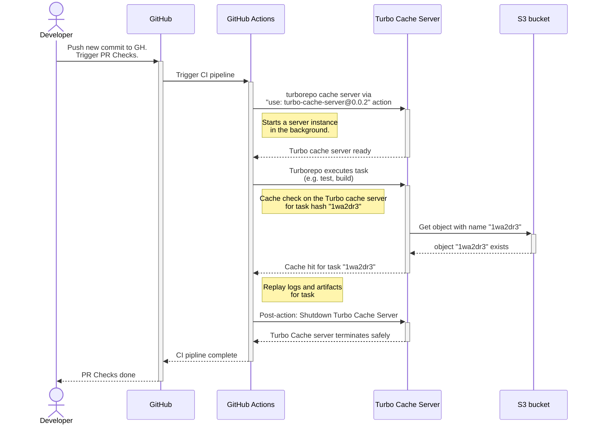
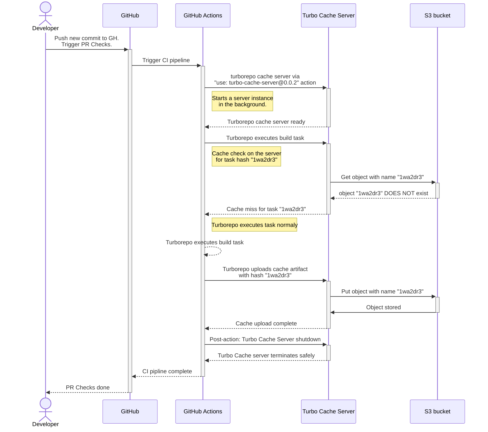

<p align="center"><br></p>
<h2 align="center">Turbo Cache Server</h2>
<p align="center">
  <a href="https://turbo.build/repo">Turborepo</a> remote cache server, <a href="https://turbo.build/repo/docs/core-concepts/remote-caching#self-hosting">API-compliant</a> as a GitHub Action with S3-compatible storage support.
</p>

### How can I use this in my monorepo?

Make sure that you have an S3-compatible storage available. We currently tested
with:

- [Amazon S3](https://aws.amazon.com/s3/)
- [Cloudflare R2](https://www.cloudflare.com/en-gb/developer-platform/r2/)
- [Minio Object Storage](https://min.io/)

You can use the Turbo Cache Server as a **GitHub Action**. Here is how:

1.  In your workflow files, add the following global environment variables:

    ```yml
    env:
      TURBO_API: "http://127.0.0.1:8585"
      TURBO_TEAM: "NAME_OF_YOUR_REPO_HERE"
      # The value of TURBO_TOKEN is irrelevant
      # as we don't perform any auth against the cache server
      # but it's still necessary for Turborepo
      TURBO_TOKEN: "turbo-token"
    ```

1.  In the same workflow file, after checking out your code,
    start the Turbo Cache Server in the background:

    ````yml - name: Checkout repository
    uses: actions/checkout@v4

        - name: Turborepo Cache Server
          uses: brunojppb/turbo-cache-server@1.0.3
          env:
            PORT: "8585"
            S3_ACCESS_KEY: ${{ secrets.S3_ACCESS_KEY }}
            S3_SECRET_KEY: ${{ secrets.S3_SECRET_KEY }}
            S3_ENDPOINT: ${{ secrets.S3_ENDPOINT }}
            S3_BUCKET_NAME: your-bucket-name-here
            # Region defaults to "eu-central-1"
            S3_REGION: "eu-central-1"
            # if your S3-compatible store does not support requests
            # like https://bucket.hostname.domain/. Setting `S3_USE_PATH_STYLE`
            # to true configures the S3 client to make requests like
            # https://hostname.domain/bucket instead.
            # Defaults to "false"
            S3_USE_PATH_STYLE: false
            # Max payload size for each cache object sent by Turborepo
            # Defaults to 100 MB
            # Requests larger than that, will get "HTTP 413: Entity Too Large" errors
            MAX_PAYLOAD_SIZE_IN_MB: "100"

        # Now you can run your turborepo tasks and rely on the cache server
        # available in the background to provide previously built artifacts (cache hits)
        # and let Turborepo upload new artifacts when there is a cache miss.
        - name: Run tasks
          run: turbo run test build typecheck
        ```
    ````

And that is all you need to use our remote cache server for Turborepo. As a
reference, take a look at
[this example workflow file](https://github.com/brunojppb/turbo-decay/blob/main/.github/workflows/ci.yml)
for inspiration.

> [!NOTE]
> These environment variables are required by Turborepo so it can call
> the Turbo Cache Server with the right HTTP body, headers and query strings.
> These environment variables are necessary so the Turborepo binary can identify
> the Remote Cache feature is enabled and can use them across all steps. You can
> [read more about this here](https://turbo.build/repo/docs/ci#setup) on the
> Turborepo official docs.

## How does that work?

Turbo Cache Server is a tiny web server written in
[Rust](https://www.rust-lang.org/) that uses any S3-compatible bucket as its
storage layer for the artifacts generated by Turborepo.

### What happens when there is a cache hit?

Here is a diagram showing how the Turbo Cache Server works within our actions
during a cache hit:



### What happens when there is a cache miss?

When a cache isn't yet available, the Turbo Cache Server will handle new uploads
and store the artifacts in S3 as you can see in the following diagram:



## Gitlab support

For folks using Gitlab or any other CI environment that supports Docker,
you can run the Turbo Cache Server as a docker container:

```shell
docker run \
  -e S3_ACCESS_KEY=KEY \
  -e S3_SECRET_KEY=SECRET \
  -e S3_BUCKET_NAME=my_cache_bucket \
  -e S3_ENDPOINT=https://s3_endpoint_here \
  -e S3_REGION=eu \
  -p "8000:8000" \
  ghcr.io/brunojppb/turbo-cache-server
```

## Development

Turbo Cache Server requires [Rust](https://www.rust-lang.org/) 1.75 or above. To
setup your environment, use the rustup script as recommended by the
[Rust docs](https://www.rust-lang.org/learn/get-started):

```shell
curl --proto '=https' --tlsv1.2 -sSf https://sh.rustup.rs | sh
```

Now run the following command to run the web server locally:

```shell
cargo run
```

### Setting up your environment

During local development, you might want to try the Turbo Dev Server locally
against a JS monorepo. As it depends on a S3-compatible service for storing
Turborepo artifacts, we recommend using [Minio](https://min.io/) with Docker
with the following command:

```shell
docker run \
  -d \
  -p 9000:9000 \
  -p 9001:9001 \
  --user $(id -u):$(id -g) \
  --name minio1 \
  -e "MINIO_ROOT_USER=minio" \
  -e "MINIO_ROOT_PASSWORD=minio12345" \
  -v ./s3_data:/data \
  quay.io/minio/minio server /data --console-address ":9001"
```

#### Setting up environment variables

Copy the `.env.example` file, rename it to `.env` and add the environment
variables required. As we use Minio locally, just go to the
[Web UI](http://localhost:9001) of Minio, create a bucket and generate
credentials and copy it to the `.env` file.

### Tests

To execute the test suite, run:

```shell
cargo test
```

While running our end-to-end tests, you might run into the following error:

```log
thread 'actix-server worker 9' panicked at /src/index.crates.io-6f17d22bba15001f/actix-server-2.4.0/src/worker.rs:404:34:
called `Result::unwrap()` on an `Err` value: Os { code: 24, kind: Uncategorized, message: "Too many open files" }
thread 'artifacts::list_team_artifacts_test' panicked at tests/e2e/artifacts.rs:81:29:
Failed to request /v8/artifacts
```

This is likely due the the maximum number of open file descriptors defined for
your user. Just run the following command to fix it:

```shell
ulimit -n 1024
```
